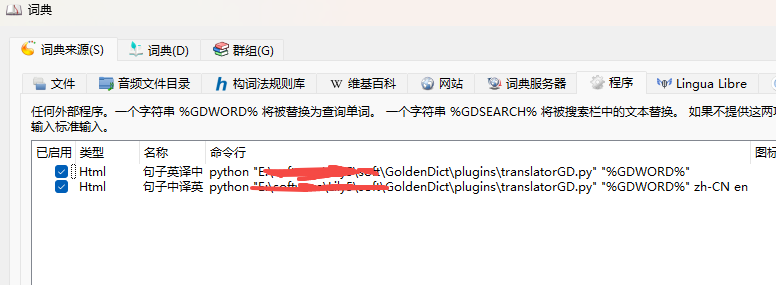
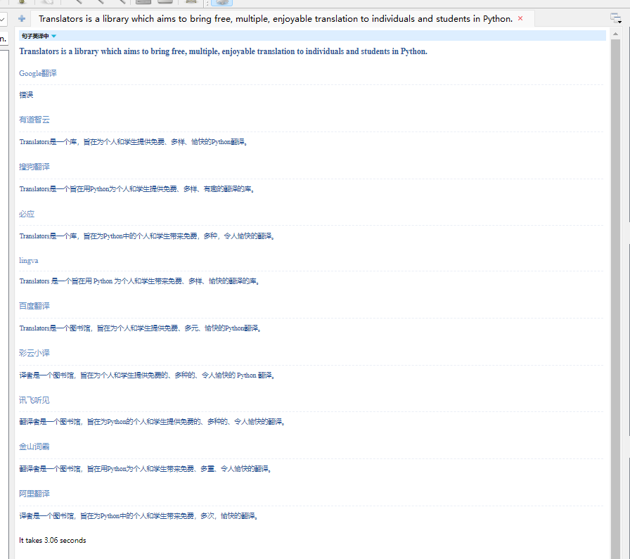
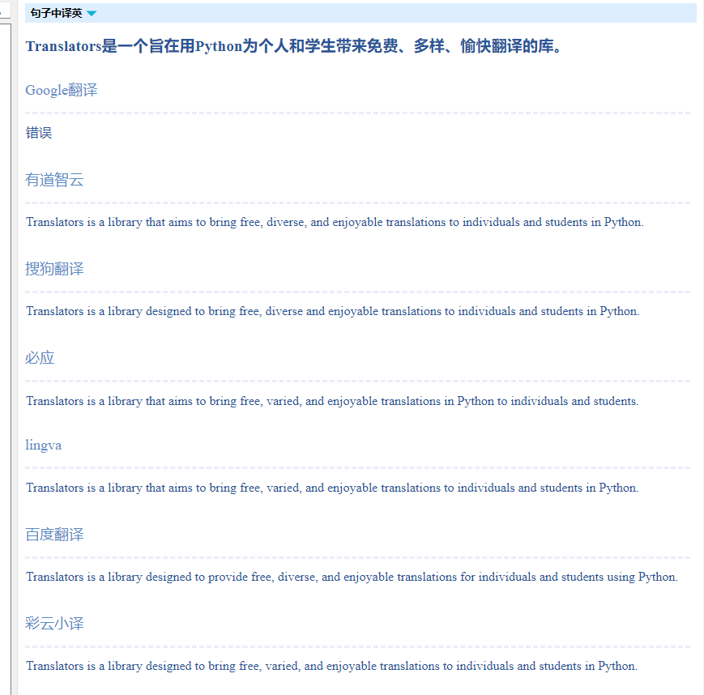

# 外部程序

## 依赖

```
pip install requests  translators
```

## 命令行

```
python translatorGD.py "需要翻译的内容"
```

支持3个参数

- originalText  第一个参数  需要翻译的内容
- fromLanguage 第二个参数 待翻译的语言, 可以用auto自动识别 默认 `en`
- toLanguage  第三个参数 目标语言, 默认 `zh-CN`

## GoldenDict配置

编辑->词典-> 词典来源-> 程序  添加相应的命令行参数

中译英

```
python "translatorGD.py" "%GDWORD%"
```

可指定语言, 如中译英

```
python "translatorGD.py" "%GDWORD%" zh-CN en
```

个人配置如下




实际效果如下





## 

# Web服务

## 依赖

```
# 在线服务需要额外安装, 注意translators依赖 需要5.8.5及以上
pip install -r requirements.txt
```

## 配置项(service.conf)

```
[service]
listen = 0.0.0.0
port = 5000
worker_threads = 16
req_timeout = 3
hide_error = 1
```

## 服务启动

```
bash startServer
```

## 测试

```
# Windows
test.bat
# linux
bash test.sh
```

## 在线配置参数

http://127.0.0.1:5000/?from=en&to=zh-CN&d=hello

- from  来源语言,默认en
- to  目标语言, 默认zh-CN
- hide  隐藏错误引擎， 0显示 ，1显示，通过service.conf修改默认值
- d   需要翻译的内容


# 感谢

https://github.com/UlionTse/translators 翻译库